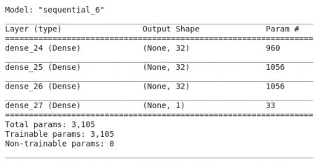
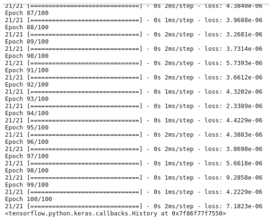
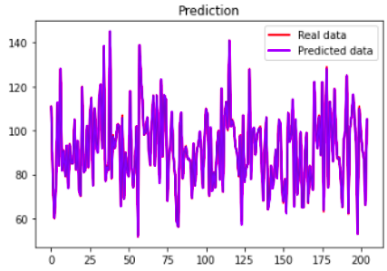
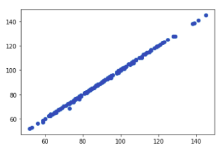



# Cricket Hackathon 2021
### (conducted by IIT Madras BSc in Programming and Data Science)

###### Team: IITMBSC06615

#### Details: https://onlinedegree.iitm.ac.in/contest/index.html

## Given:

* Ball-by-ball data from 1600 innings of the past T-20 matches.

* Sample input file which the code has to accept and process.

## Output:

* For each innings of each match, the output of the code must be a single number, which is the score at the end of the 6th over.

## Algorithm

### 1. Preprocessing

* Remove extra columns from the data and keep only the following:

```
    1. venue
    2. innings
    3. ball
    4. batting_team
    5. bowling_team
    6. striker
    7. non_striker
    8. bowler
    9. runs_off_bat
    10. extras
```
* Calculate **total runs** as sum of **runs_off_bat** and **extras**.
* Keep data whose **ball** < 6, discard the rest of the rows. This is because our aim is to find the total runs only upto 6 overs, which makes other balls irrelevant to the problem statement.
* Keep data where **innings** <= 2, discard the rest of the rows
* Create a new column called **batsmen** as a list of values from columns **striker** and **non_striker**. This is because the test input only provides a single column with all batsmen in the 6 overs.
* Group the rows on **match_id** using the following aggregation functions for each of the columns:

```
  1. venue - first
  2. innings - first
  3. batting_team - first
  4. bowling_team - first
  5. total_runs - sum
  6. batsmen - list
  7. bowler - list
```

* Create a list of unique batsmen from the column batsmen as **batsmen_all**
* Similarly create **bowler_all**
* Create two dictionaries **batsmen_dict** and **bowler_dict** with a digit to represent each of the unique values from batsmen_all and bowler_all, respectively. This is done for encoding the batsmen and bowlers.
* Create and store pkl files of batsmen_dict and bowler_dict to use for the test set later
* Replace the batsmen column values with the corresponding encodings from batsmen_dict, similarly for bowler column values, using bowler_dict
* Split the batsmen ecoded list values into separate columns as batsmen_0, batsmen_1, etc. Similarly split for bowler into bowlers_0, bowlers_1, etc.
* Drop the batsmen and bowler columns as the values have already been inserted as new columns.
* Create two objects of **LabelEncoder()** as **venue_encoder** and **team_encoder**
* Fit the venue, batting_team, bowling team using the encoder objects.
* Encode the venue, batting_team, bowling team columns using the fit encoders
* Store the fit encoders for later use during testing
* Split the data into training and testing, with testing being column total_runs and training being rest of the columns apart from total_runs
* Use sklearn’s train_test_split to split the data into training and testing sets: x_train, x_test, y_train, y_test
* Create an object of StandardScaler() and fit on the x_train data, use it to transform the x_test data
* Create a object of MinMaxScaler() and fit the y_train data, use it to transform the y_test data
* Store both the x data scaler as well as y data scaler for later use.

### 2. Training
* Create a **keras Sequential model** object
* Model is created as the layers shown below
* Fit the model on x_test and y_test with batch_size=10 and epochs = 100
* Store the model for training purpose

### 3. Validation
* Use the trained model on x_test and store the results


*Figure 1: Model Summary*


*Figure 2: Model Training*

* Perform inverse transform on y_test and y_pred, to obtain the original values for comparison using the same MinMaxScaler object we created before.
* Plot the data to view the results


*Figure 3: Validation*

### 4. Testing
* Read the test input
* Read the batsmen and bowler encoding dictionary as **batsmen_dict** and **bowlers_dict**
* Replace the batsmen column with the corresponding encoding values from batsmen_dict, for new values suppply new encoding values. Perform similarly for bowlers using bowlers_dict
* Split the encoded list values in bowlers and batsmen columns into new lists as bowlers_0, bowlers_1 etc and similarly for batsmen_0, batsmen_1 etc.
* Drop the batsmen and bowlers columns
* Read the previously stored venue and team encoders. Use them to encode the venue, batting_team and bowling_team columns
* Ensure the order of columns, and their names are as below and fill empty values with zero


*Figure 4: Validation*

```
1. venue
2. innings
3. batting_team
4. bowling_team
5. batsmen_0
6. batsmen_1
7. batsmen_2
8. batsmen_3
9.  batsmen_4
10. batsmen_5
11. batsmen_6
12. batsmen_7
13. batsmen_8
14. batsmen_9
15. batsmen_10
16. batsmen_11
17. batsmen_12
18. bowler_0
19. bowler_1
20. bowler_2
21. bowler_3
22. bowler_4
23. bowler_5
24. bowler_6
25. bowler_7
26. bowler_8
27. bowler_9
```
* Read the stored Scaler object and use it to transform the data. Store it as x_test.
* Read the stored Keras Sequential Model and use it to predict the scores with x_test
* Load the stored Target Scaler and inverse transform the prediction of the model
* Return the prediction to the main function as result


